# 🎬 Movie Search App

A responsive movie search application built with React, Firebase, and the IMDb API. Users can explore movies, manage their favorites and watchlist, and securely log in via Google or email.

## 🚀 Features

- 🔍 **Real-time Movie Search:** Instantly find movies using the IMDb API via RapidAPI.
- 🔐 **Authentication:** Google and email/password login using Firebase Authentication.
- ❤️ **Favorites:** Mark and manage your favorite movies.
- 📺 **Watchlist:** Keep track of movies to watch later.
- 📱 **Responsive Design:** Mobile-first design using Tailwind CSS.
- 🎯 **Modern UI:** Clean look with Lucide icons.
- ✅ **Form Validation:** Seamless sign-in and sign-up using React Hook Form.

## 🛠️ Tech Stack
Frontend: React, Vite, Tailwind CSS
Authentication & Database: Firebase Authentication + Firestore
Icons: Lucide Icons
Forms: React Hook Form
Movie Data API: IMDb API

## 🔑 Environment Variables
Create a .env file in the root directory with the following keys:

VITE_FIREBASE_API_KEY=your_firebase_api_key
VITE_FIREBASE_AUTH_DOMAIN=your_project.firebaseapp.com
VITE_FIREBASE_PROJECT_ID=your_project_id
VITE_FIREBASE_STORAGE_BUCKET=your_project.appspot.com
VITE_FIREBASE_MESSAGING_SENDER_ID=your_messaging_sender_id
VITE_FIREBASE_APP_ID=your_app_id
API_KEY=your_rapidapi_key

## 📦 Setup
Clone the repository:
git clone https://github.com/your-username/movie-search-app.git
cd movie-search-app

Install dependencies:
npm install

Start the development server:
npm run dev

Open the app in your browser at http://localhost:5173

📡 Deployment
You can deploy this app on:

Firebase Hosting
Vercel
Netlify

movie-search-app/
├── public/                     # Public assets
│   ├── logo.svg                # App logo
│   └── ...                     # Other static files
├── src/                        # Source code
│   ├── assets/                 # Images, fonts, and other assets
│   ├── components/             # Reusable React components
│   │   ├── Navbar.jsx          # Navigation bar
│   │   ├── Favorites.jsx       # Favorites component
│   │   ├── Watchlist.jsx       # Watchlist component
│   │   └── ...                 # Other components
│   ├── pages/                  # Page-level components
│   │   ├── Home.jsx            # Home page
│   │   ├── MovieDetails.jsx    # Movie details page
│   │   ├── SignIn.jsx          # Sign-in page
│   │   ├── SignUp.jsx          # Sign-up page
│   │   └── ...                 # Other pages
│   ├── context/                # Context API files
│   │   └── MovieContext.js     # Context for managing movie data
│   ├── firebase.js             # Firebase configuration
│   ├── App.jsx                 # Main app component
│   ├── main.jsx                # Entry point for React
│   └── styles/                 # Global styles (if applicable)
│       └── ...                 # CSS or Tailwind configuration
├── screenshots/                # Screenshots for documentation
│   ├── home-page.png           # Screenshot of the home page
│   ├── search-results.png      # Screenshot of search results
│   ├── movie-details.png       # Screenshot of movie details
│   └── ...                     # Other screenshots
├── .env                        # Environment variables
├── .gitignore                  # Git ignore file
├── index.html                  # HTML template
├── package.json                # Project dependencies and scripts
├── README.md                   # Project documentation
└── vite.config.js              # Vite configuration

🙌 Acknowledgements
Firebase: For authentication and Firestore database.
RapidAPI: For providing the IMDb API.
Lucide Icons: For modern and customizable icons.
React Hook Form: For seamless form handling.

🎥 Live Demo
Check out the live version of the app here: Movie Search App Live Demo

## 📸 Screenshots

### 🔍 Home Page
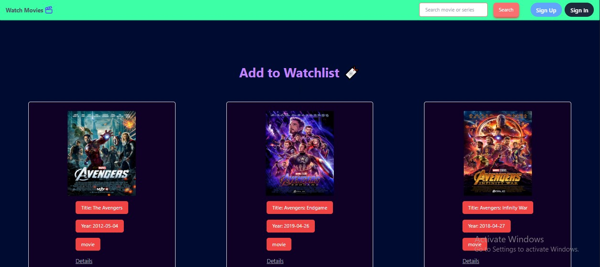

### 🎬 Movie Results
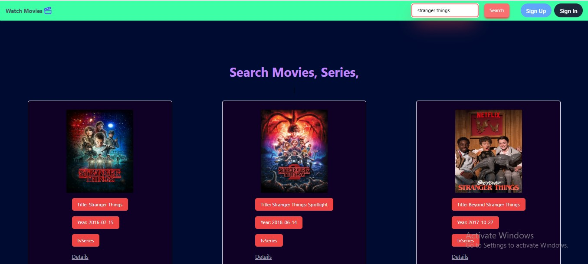

### 🎬 Movie Details
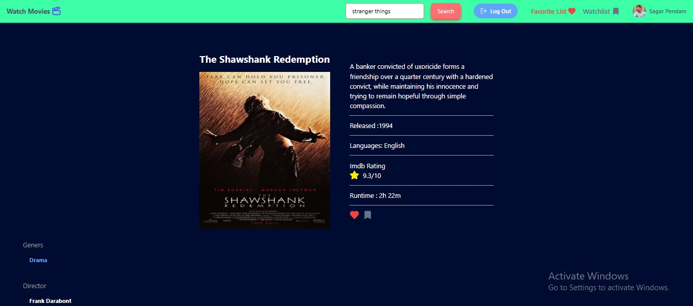

### 🎬 Sign Up
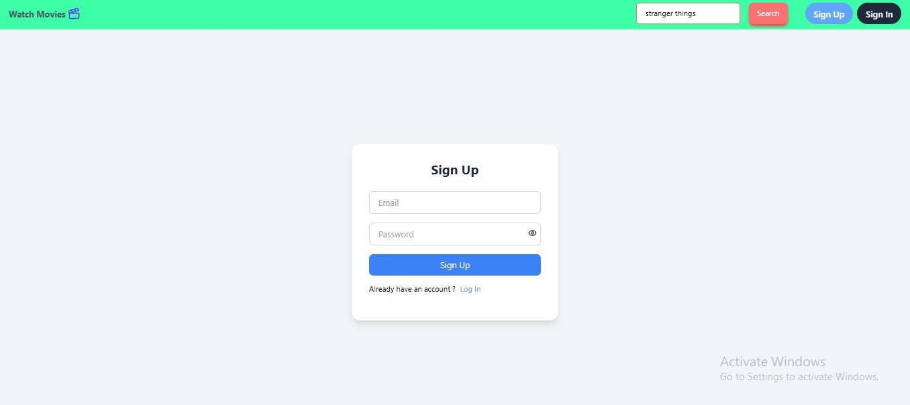

### 🎬 Sign In
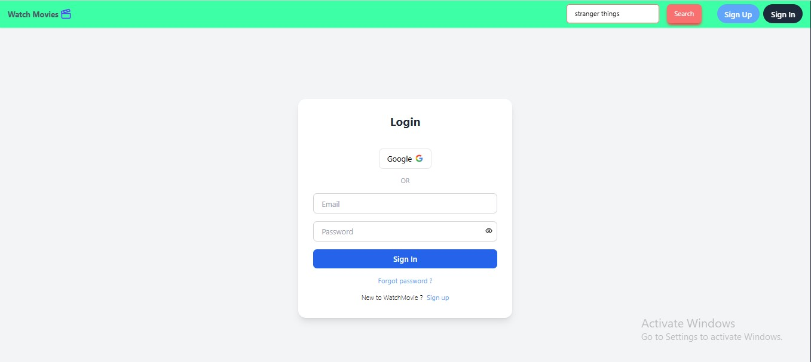

### ⭐ Favorites 
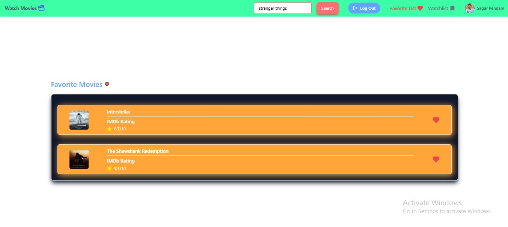

### ⭐ Watchlist

## 📱 Responsive Views
The app is fully responsive and adapts to different screen sizes. Below are examples of how it looks on mobile and tablet devices:

1. Mobile View (Small Screens)
### 🔍 Home Page
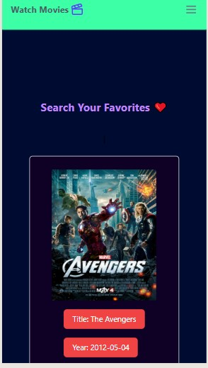

### 🎬 Movie Details
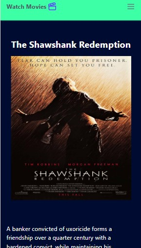

### ⭐ Favorites 
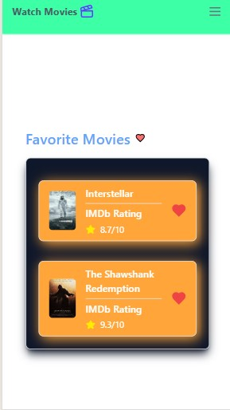

### ⭐ Watchlist
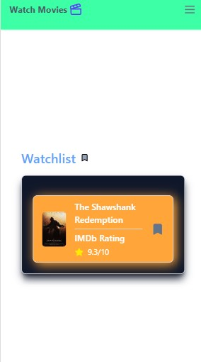

2. Tablet View (Medium Screens)

### 🔍 Home Page
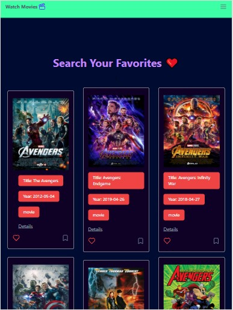

### 🎬 Movie Details
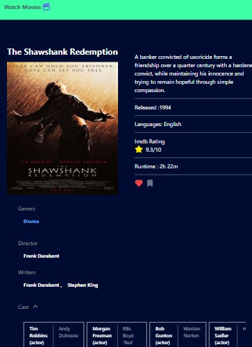

### ⭐ Favorites 
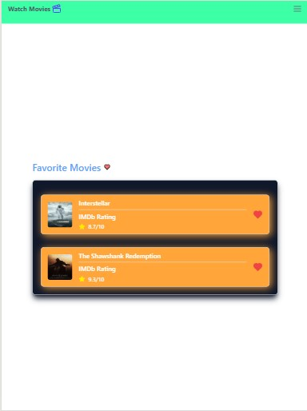

### ⭐ Watchlist
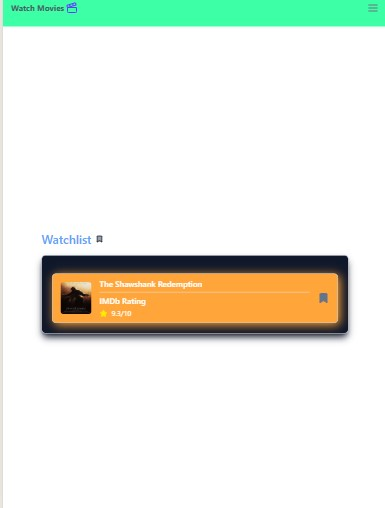

